# 环节配置 Tips

这一部分，为没有使用过 vscode 进行开发的小伙伴准备的，让大家快速上手 vscode ，并且配置好远程连接开发机的环境，减少大家在后续课程中的出现运行服务的错误。

## 安装 vscode

首先打开[vscode](https://code.visualstudio.com/Download)下载界面，点击 System Installer x64 的安装包下载。
> 根据自身电脑系统选择对应的安装包，如果你是 Mac 用户，请下载 Mac 版本，如果是 Linux 用户请点击下载对应的 deb 安装包。

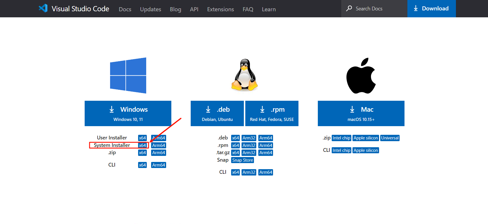

下载完成以后，找到下载好的安装程序，双击运行，安装完成以后，打开 vscode 。

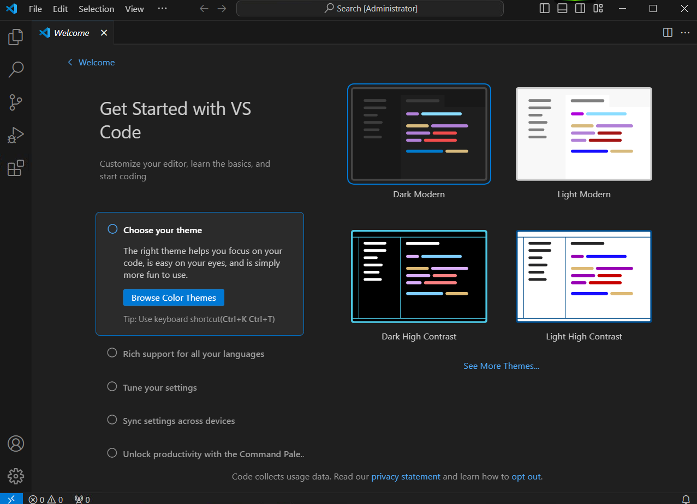


## 安装 vscode 插件

安装完 vscode 之后，打开 vscode 并点击左侧的扩展按钮，搜索并安装如下插件：

- Remote SSH


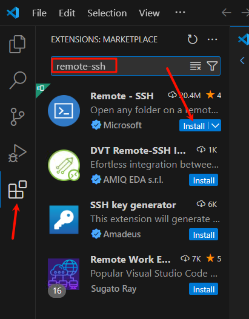

点击 Install ，安装 Remote SSH 的同时也会安装

- Remote - SSH: Editing Configurat
- Remote Explorer

## 配置 vscode 远程连接开发机

安装完插件之后，我们来到[InternStudio](https://studio.intern-ai.org.cn/)，创建开发机，然后我们启动开发机，点击 SSH 连接。

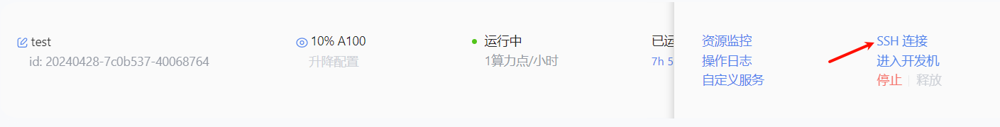

复制登录命令

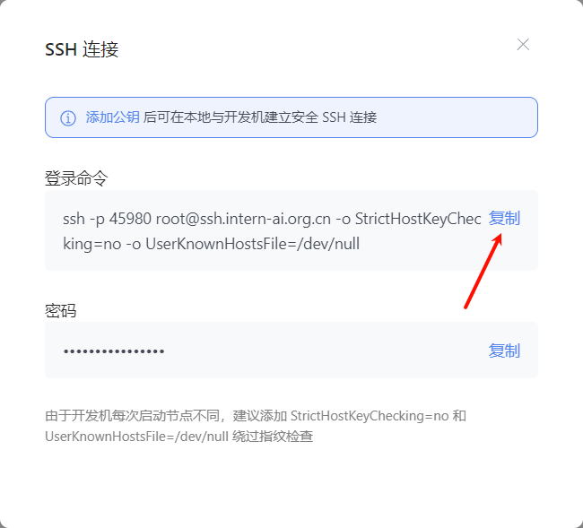

然后回到 vscode 点击左侧的远程按钮，点击 SSH 的 + 号，在弹出的窗口中输入开发机的登录命令。

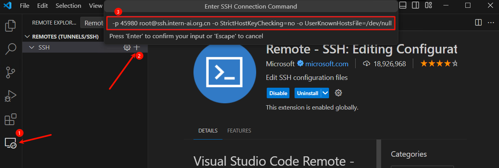

将 ssh 登录信息写入配置文件，我们刷新 ssh 列表就可以看到我们刚刚配置的 ssh 连接了。

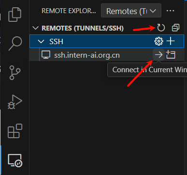

点击连接，输入密码，就成功连接到开发机了。

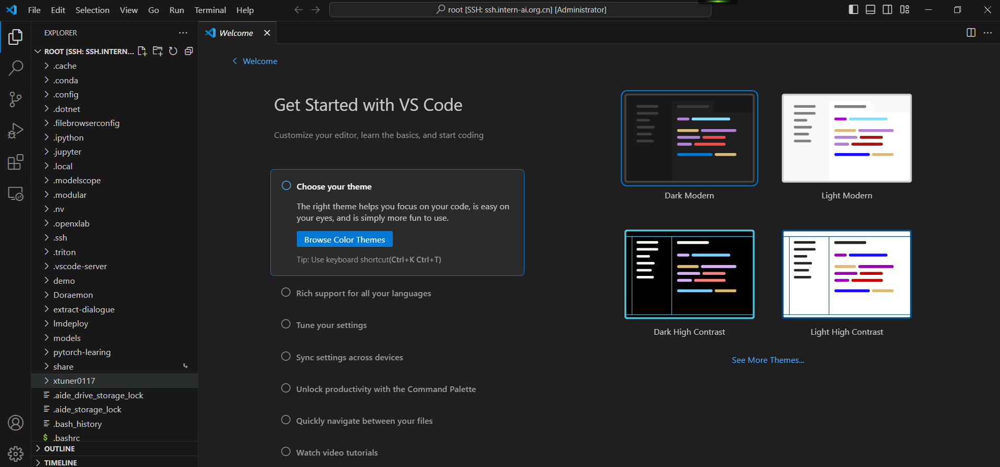


## 配置 vscode 端口映射

下面会介绍两种端口映射的方法：

### 方法一：
我们可以使用 `Ctrl + Shift + ~` 快捷键打开 vscode 终端，然后点击右边的 Ports 界面，接着点击 Foward a Port 按钮。

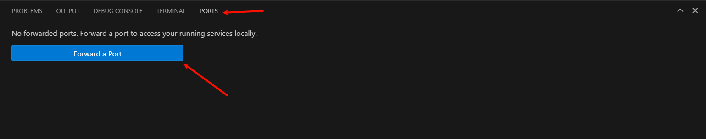

比如我们的端口为 6006 在这里我们就可以这样设置。

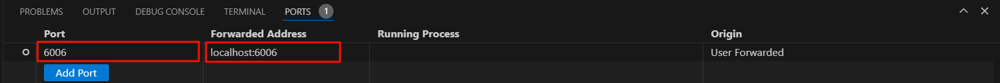

其中第一个 port 是映射在本机的端口，后面的Fowarded Address 是开发机的IP地址和端口。也就是将开发机的 6006 端口映射在了本机的 6006 这个端口，当然本机的端口是可以更改的。

但我们运行 streamlit 或者是 gradio 应用的时候，vscode 会自动的帮我们进行端口映射，并不需要我们手动操作，所以我们介绍另一种端口映射方法，也是最常用的。

### 方法二：

我们打开本机的终端，我们使用 powershell，但是要确保你的本机是由 OpenSSH 服务的。

1. 配置 ssh 密钥

配置 ssh 密钥一方面是方便我们登录，这样我们不用每次连接都需要输入密码，另一方面是为了我们端口映射的安全。
首先我们需要配置 ssh 密钥， 在powershell 中输入以下命令；

```bash
ssh-keygen -t rsa
```

公钥默认存储在 `~/.ssh/id_rsa.pub`，可以通过系统自带的 cat 工具查看文件内容：

```bash
cat ~/.ssh/id_rsa.pub
```
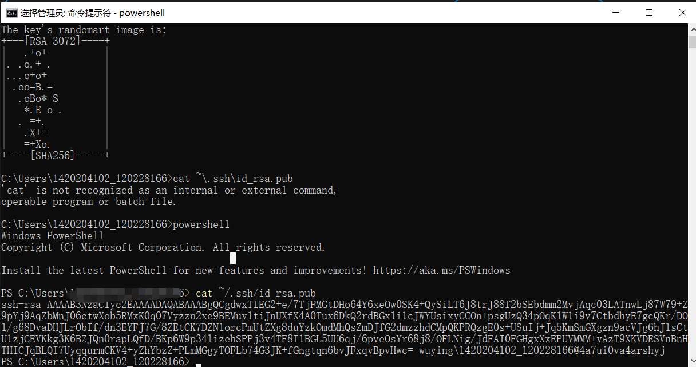


2. 将 ssh 密钥添加到 InternStudio中

我们回到 InternStudio，找到配置 SSH Key，将我们刚刚生成的 ssh 公钥添加到 InternStudio 中，它会自动识别主机名称。

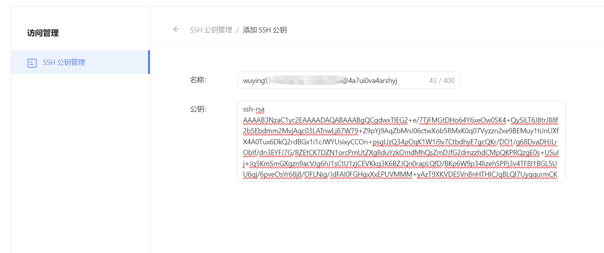

3. 进行端口映射

接着我们来到开发机控制台，点击自定义服务，复制下面的命令：

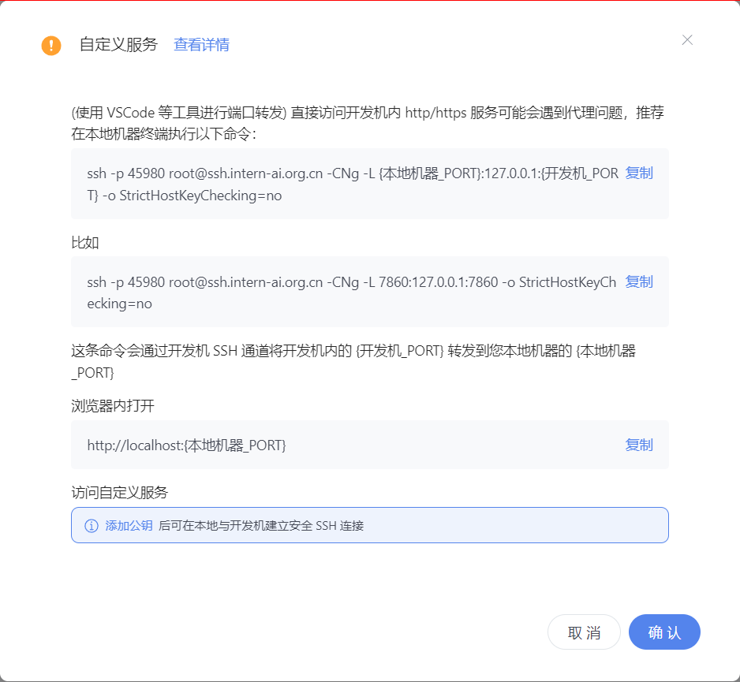

```bash
ssh -p 45980 root@ssh.intern-ai.org.cn -CNg -L 7860:127.0.0.1:7860 -o StrictHostKeyChecking=no
```
> 其中 45980 是你当前运行的开发机的端口，7860 是我们要进行映射端口，这个端口要根据运行的应用程序的端口来自行修改。

将复制的命令粘贴到本机的 powershell 中，回车

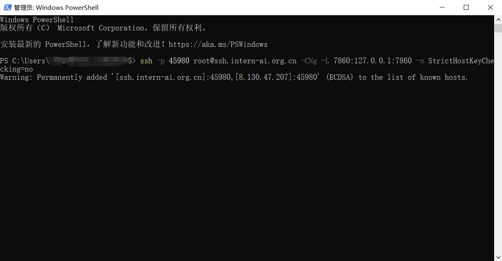

如果出现如上图所示的情况，就说明已经成功进行了端口映射，它不输出任何信息是正常的，因为端口映射服务正在运行，接下来大家就可以快乐的进行课程实践了。