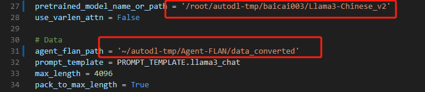

# Llama 3 Agent 能力体验+微调（Lagent 版）

## 1. Llama3 ReAct Demo

首先我们先来使用基于 Lagent 的 Web Demo 来直观体验一下 Llama3 模型在 ReAct 范式下的智能体能力。我们让它使用 ArxivSearch 工具来搜索 InternLM2 的技术报告。
从图中可以看到，Llama3-8B-Instruct 模型并没有成功调用工具。原因在于它输出了 `query=InternLM2 Technical Report` 而非 `{'query': 'InternLM2 Technical Report'}`，这也就导致了 ReAct 在解析工具输入参数时发生错误，进而导致调用工具失败。 


Lagent Web Demo 部分详见 [Lagent Web Demo](#4-lagent-web-demo)。

## 2. 微调过程

接下来我们带大家使用 XTuner 在 Agent-FLAN 数据集上微调 Llama3-8B-Instruct，以让 Llama3-8B-Instruct 模型获得智能体能力。
Agent-FLAN 数据集是上海人工智能实验室 InternLM 团队所推出的一个智能体微调数据集，其通过将原始的智能体微调数据以多轮对话的方式进行分解，对数据进行能力分解并平衡，以及加入负样本等方式构建了高效的智能体微调数据集，从而可以大幅提升模型的智能体能力。

### 2.1 环境配置

我们先来配置相关环境。使用如下指令便可以安装好一个 python=3.10 pytorch=2.1.2+cu121 的基础环境了。
（如果使用datawahle镜像则无需配置如下内容）
```bash
conda create -n llama3 python=3.10
conda activate llama3
conda install pytorch==2.1.2 torchvision==0.16.2 torchaudio==2.1.2 pytorch-cuda=12.1 -c pytorch -c nvidia
```

接下来我们安装 XTuner。

```bash
cd ~/autodl-tmp/
git clone https://github.com/SmartFlowAI/Llama3-Tutorial
git clone -b v0.1.18 https://github.com/InternLM/XTuner
cd XTuner
pip install -e .[all]
```

最后，我们 clone 本教程仓库。

```bash
cd ~/autodl-tmp/
git clone https://github.com/SmartFlowAI/Llama3-Tutorial
```


### 2.2 模型准备

在微调开始前，我们首先来准备 Llama3-8B-Instruct 模型权重。

```shell
cd ~/autodl-tmp/
# 新建一个down.py文件
# 写入

import torchfrom modelscope import snapshot_download, AutoModel, utoTokenizer import os
# 这里我用了llama3中文社区的微调模型，如果需要别的以相同方法到modelscope下载模型
model_dir = snapshot_download('baicai003/Llama3-Chinese_v2',cache_dir='/root/autodl-tmp', revision='master')


#然后在~/autodl-tmp/ 下执行
python down.py
```

### 2.3 数据集准备

```bash
cd ~/autodl-tmp/
git clone https://www.modelscope.cn/datasets/AI-ModelScope/Agent-FLAN.git

# 我这边下载不全不知道为啥，如果和我一样请大家到魔搭上手动下载送入这个文件里。大家看如果有的问文件是1k就有问题，请手动。
```

由于  Agent-FLAN 数据集暂时无法被 XTuner 直接加载，因此我们首先要下载到本地，然后转换成 XTuner 直接可用的格式。


我们已经在 SmartFlowAI/Llama3-Tutorial 仓库中已经准备好了相关转换脚本。

```bash
python ~/autodl-tmp/Llama3-Tutorial/tools/convert_agentflan.py ~/autodl-tmp/Agent-FLAN/data
```

在显示下面的内容后，就表示已经转换好了。转换好的数据位于 ~/autodl-tmp/Agent-FLAN/data_converted

```bash
Saving the dataset (1/1 shards): 100%|████████████| 34442/34442
```

### 2.4 微调启动

我们已经为大家准备好了可以一键启动的配置文件，主要是修改好了模型路径、对话模板以及数据路径。

这里我们也需要对~/autodl-tmp/Llama3-Tutorial/configs/llama3-agentflan/llama3_8b_instruct_qlora_agentflan_3e.py修改一下~



我们使用如下指令以启动训练：

```bash
export MKL_SERVICE_FORCE_INTEL=1
xtuner train ~/autodl-tmp/Llama3-Tutorial/configs/llama3-agentflan/llama3_8b_instruct_qlora_agentflan_3e.py --work-dir ~/autodl-tmp/llama3_agent_pth --deepspeed deepspeed_zero2
```

在训练完成后，我们将权重转换为 HuggingFace 格式，并合并到原权重中。

```bash
# 转换权重
xtuner convert pth_to_hf ~/autodl-tmp/Llama3-Tutorial/configs/llama3-agentflan/llama3_8b_instruct_qlora_agentflan_3e.py \
    ~/autodl-tmp/llama3_agent_pth/iter_18516.pth \
    ~/autodl-tmp/llama3_agent_pth/iter_18516_hf
```


## 3. Llama3+Agent-FLAN ReAct Demo

在合并权重后，我们再次使用 Web Demo 体验一下它的智能体能力吧~

可以看到，经过 Agent-FLAN 数据集的微调后，Llama3-8B-Instruct 模型已经可以成功地调用工具了，其智能体能力有了很大的提升。


## 4. Lagent Web Demo

因为我们在微调前后都需要启动 Web Demo 以观察效果，因此我们将 Web Demo 部分单独拆分出来。

首先我们先来安装 lagent。

```bash
pip install lagent
```

然后我们使用如下指令启动 Web Demo：

```bash
streamlit run ~/autodl-tmp/Llama3-Tutorial/tools/agent_web_demo.py 微调前/后 LLaMA3 模型路径
```

- 微调前 LLaMA3 路径：`/root/autodl-tmp/baicai003/Llama3-Chinese_v2`
- 微调后 LLaMA3 路径：`/root/autodl-tmp/llama3_agent_pth/merged`
