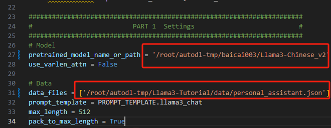

# XTuner 微调 Llama3 个人小助手认知(autodl)

## 环境配置

（如果使用datawahle镜像则无需配置如下内容）
```shell
conda create -n llama3 python=3.10
conda activate llama3
conda install pytorch==2.1.2 torchvision==0.16.2 torchaudio==2.1.2 pytorch-cuda=12.1 -c pytorch -c nvidia
```

## 下载模型

新建文件夹

```shell
cd ~/autodl-tmp/
# 新建一个down.py文件
# 写入

import torchfrom modelscope import snapshot_download, AutoModel, utoTokenizer import os
# 这里我用了llama3中文社区的微调模型，如果需要别的以相同方法到modelscope下载模型
model_dir = snapshot_download('baicai003/Llama3-Chinese_v2',cache_dir='/root/autodl-tmp', revision='master')


#然后在~/autodl-tmp/ 下执行
python down.py
```

## Web Demo 部署

```shell
cd ~/autodl-tmp/
git clone https://github.com/SmartFlowAI/Llama3-Tutorial
```

安装 XTuner 时会自动安装其他依赖
```shell
cd ~/autodl-tmp/
git clone https://github.com/SmartFlowAI/Llama3-Tutorial
git clone -b v0.1.18 https://github.com/InternLM/XTuner
cd XTuner
pip install -e .
```

运行 web_demo.py
(无卡模式的宝子们 现在关机打开显卡)
```shell
streamlit run ~/autodl-tmp/Llama3-Tutorial/tools/internstudio_web_demo.py \
  ~/autodl-tmp/baicai003/Llama3-Chinese_v2  --server.port 6006 --server.address 0.0.0.0
```


## 自我认知训练数据集准备

```shell
cd ~/autodl-tmp/Llama3-Tutorial
python tools/gdata.py 
```
以上脚本在生成了 ~/autodl-tmp/Llama3-Tutorial/data/personal_assistant.json 数据文件格式如下所示：
```json
[
    {
        "conversation": [
            {
                "system": "你是一个懂中文的小助手",
                "input": "你是（请用中文回答）",
                "output": "您好，我是SmartFlowAI，一个由 SmartFlowAI 打造的人工智能助手，请问有什么可以帮助您的吗？"
            }
        ]
    },
    {
        "conversation": [
            {
                "system": "你是一个懂中文的小助手",
                "input": "你是（请用中文回答）",
                "output": "您好，我是SmartFlowAI，一个由 SmartFlowAI 打造的人工智能助手，请问有什么可以帮助您的吗？"
            }
        ]
    }
]
```


## XTuner配置文件准备

小编为大佬们修改好了[configs/assistant/llama3_8b_instruct_qlora_assistant.py](./configs/assistant/llama3_8b_instruct_qlora_assistant.py) 配置文件(主要修改了模型路径和对话模板)请直接享用～

注意：因为我们在autodl环境并且换了环境，请按照下图对configs/assistant/llama3_8b_instruct_qlora_assistant.py中的内容进行修改！！！！


## 训练模型


```Bash
cd ~/autodl-tmp/Llama3-Tutorial

# 开始训练,使用 deepspeed 加速，A100 40G显存 耗时24分钟
xtuner train configs/assistant/llama3_8b_instruct_qlora_assistant.py --work-dir /root/autodl-tmp/llama3_pth

# Adapter PTH 转 HF 格式
xtuner convert pth_to_hf /root/autodl_tmp/llama3_pth/llama3_8b_instruct_qlora_assistant.py \
  /root/autodl_tmp/llama3_pth/iter_500.pth \
  /root/autodl_tmp/llama3_hf_adapter

# 模型合并
export MKL_SERVICE_FORCE_INTEL=1
xtuner convert merge /root/autodl_tmp/baicai003/Llama3-Chinese_v2 \
  /root/autodl_tmp/llama3_hf_adapter\
  /root/autodl_tmp/llama3_hf_merged
```

## 推理验证

```shell
streamlit run ~/autodl_tmp/Llama3-Tutorial/tools/internstudio_web_demo.py \
  /root/autodl_tmp/llama3_hf_merged
```

此时 Llama3 拥有了他是 SmartFlowAI 打造的人工智能助手的认知。 


