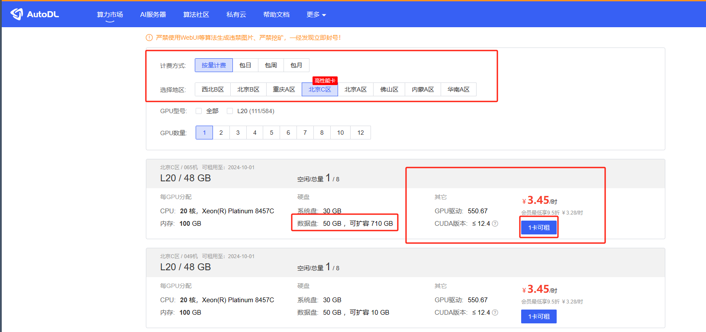
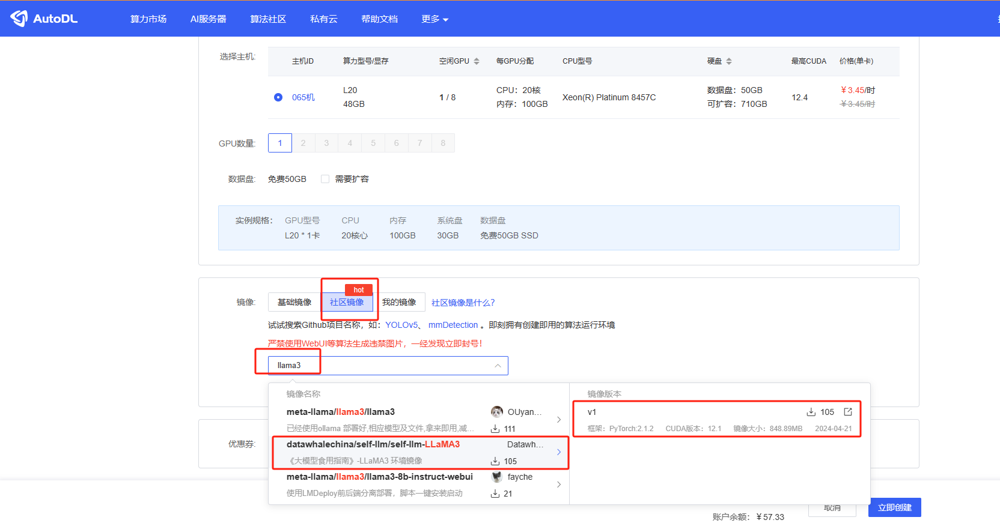
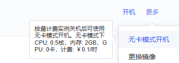
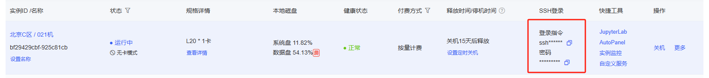
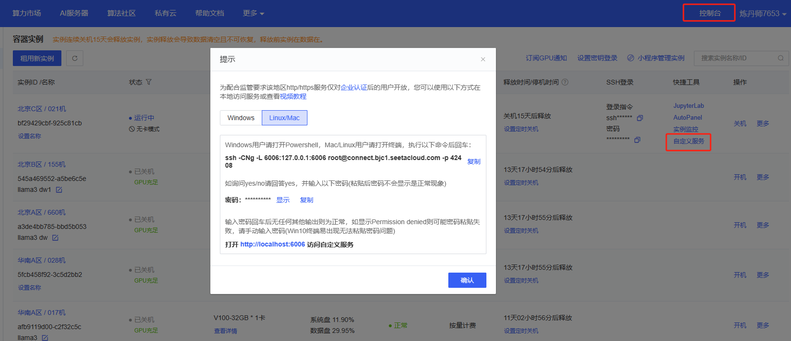

# 环节配置 Tips


## VSCode 远程连接 InternStudio 开发机

这一部分，为没有使用过 VSCode 进行开发的小伙伴准备的，让大家快速上手 VSCode ，并且教大家如何创建开发机以及，使用 VSCode 配置好远程连接开发机的环境，减少大家在后续课程中的出现运行服务的错误。

### 一、安装 VSCode

首先打开[VSCode](https://code.visualstudio.com/Download)下载界面，点击 System Installer x64 的安装包下载。
> 根据自身电脑系统选择对应的安装包，如果你是 Mac 用户，请下载 Mac 版本，如果是 Linux 用户请点击下载对应的 deb 安装包。


下载完成以后，找到下载好的安装程序，双击运行，安装完成以后，打开 VSCode 。


### 安装 VSCode 插件

安装完 VSCode 之后，打开 VSCode 并点击左侧的扩展按钮，搜索并安装如下插件：

- Remote SSH


点击 Install ，安装 Remote SSH 的同时也会安装

- Remote - SSH: Editing Configurat
- Remote Explorer

### 二、配置 VSCode 远程连接开发机

安装完插件之后，我们来到[autodl](https://www.autodl.com/)，可以看到以下界面，我们到算力市场->北京C区->条一台L20（如果只是微调任务可以去北京B找一台4090），尽量选择内存比较大的设备，后面我们有扩容的需求。



接着我们配置开发机的名称，镜像以及GPU资源,社区镜像中输入llama3 然后找到datawhale的镜像




完成开发机创建以后，我们启动开发机，点击 SSH 连接。（我们建议大家先用无卡模型配置，然后用卡模型进行微调，这样可以节约费用）





复制登录命令

然后回到 VSCode 点击左侧的远程按钮，点击 SSH 的 + 号，在弹出的窗口中输入开发机的登录命令。


将 ssh 登录信息写入配置文件，我们刷新 ssh 列表就可以看到我们刚刚配置的 ssh 连接了。


点击连接，输入密码，就成功连接到开发机了。


### 三、配置 VSCode 端口映射

下面会介绍两种端口映射的方法：

#### 方法一：
我们可以使用 `Ctrl + Shift + ~` 快捷键打开 VSCode 终端，然后点击右边的 Ports 界面，接着点击 Foward a Port 按钮。


比如我们的端口为 6006 在这里我们就可以这样设置。


其中第一个 port 是映射在本机的端口，后面的Fowarded Address 是开发机的IP地址和端口。也就是将开发机的 6006 端口映射在了本机的 6006 这个端口，当然本机的端口是可以更改的。

但我们运行 streamlit 或者是 gradio 应用的时候，VSCode 会自动的帮我们进行端口映射，并不需要我们手动操作，所以我们介绍另一种端口映射方法，也是最常用的。

#### 方法二：

进行端口映射

我们来到开发机控制台，点击自定义服务，复制下面的命令：



```bash
ssh -CNg -L 6006:127.0.0.1:6006 root@connect.bjc1.seetacloud.com -p 42408
```
> 其中 42408 是你当前运行的开发机的端口，6006 是我们要进行映射端口，这个端口要根据运行的应用程序的端口来自行修改。

将复制的命令粘贴到本机的 vscode terminal 中，输入yes，输入密码回车 （可能会卡住，正常现象）


然后进入 http://localhost:6006 即可访问，当然你没服务的时候是没反应的。
