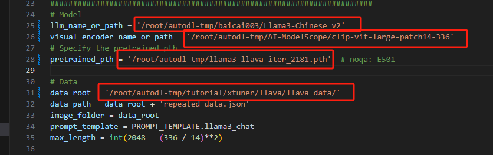

# XTuner 微调 Llama3 图片理解多模态

随着 XTuner 团队放出了基于 Llama3-8B 的 LLaVA 模型，我们也是第一时间与 XTuner 团队取得了联系，并获得了他们已经预训练好的 Image Projector。接下来，我们将带大家基于 Llama3-8B-Instruct 和 XTuner 团队预训练好的 Image Projector 微调自己的多模态图文理解模型 LLaVA。

## 环境、模型、数据准备

### 配置环境

注意：本次课程使用的算力和内存较大，建议L20 GPU + 50G存储扩充

我们先来配置相关环境。使用如下指令便可以安装好一个 python=3.10 pytorch=2.1.2+cu121 的基础环境了。
（如果使用datawahle镜像则无需配置如下内容）
```bash
conda create -n llama3 python=3.10
conda activate llama3
conda install pytorch==2.1.2 torchvision==0.16.2 torchaudio==2.1.2 pytorch-cuda=12.1 -c pytorch -c nvidia
```
接下来我们安装 XTuner。

```bash
cd ~/autodl-tmp/
git clone https://github.com/SmartFlowAI/Llama3-Tutorial
git clone -b v0.1.18 https://github.com/InternLM/XTuner
cd XTuner
pip install -e .[all]
```

最后我们 clone 本教程仓库。

```bash
cd ~/autodl-tmp/
git clone https://github.com/SmartFlowAI/Llama3-Tutorial
```

### 模型准备

#### 准备 Llama3 权重、Image Projector 权重

在微调开始前，我们首先来准备 Llama3-8B-Instruct 模型权重及clip-vit-large-patch14-336 权重( Visual Encoder 权重)。

```shell
cd ~/autodl-tmp/
# 新建一个down.py文件
# 写入

import torchfrom modelscope import snapshot_download, AutoModel, utoTokenizer import os
# 这里我用了llama3中文社区的微调模型，如果需要别的以相同方法到modelscope下载模型
model_dir = snapshot_download('baicai003/Llama3-Chinese_v2',cache_dir='/root/autodl-tmp', revision='master')
model_dir = snapshot_download('AI-ModelScope/clip-vit-large-patch14-336', cache_dir='/root/autodl-tmp', revision='master')

#然后在~/autodl-tmp/ 下执行
python down.py
```

有一个预训练模型iter_2181_new.pth需要大家从互联网下载
cd ~/autodl-tmp/
git clone https://gitee.com/bardwang/llama3-tutorial-iter_2181_new.git
mv ~/autodl-tmp/llama3-tutorial-iter_2181_new/iter_2181_new.pth ~/autodl-tmp/

### 数据准备

我们按照 https://github.com/InternLM/Tutorial/blob/camp2/xtuner/llava/xtuner_llava.md 中的教程来准备微调数据。为了让大家可以快速上手，我们选择了使用过拟合的方式快速实现。


可以执行以下代码：

```bash
cd ~/autodl-tmp/
git clone https://github.com/InternLM/tutorial -b camp2
python ~/autodl-tmp/tutorial/xtuner/llava/llava_data/repeat.py \
  -i ~/autodl-tmp/tutorial/xtuner/llava/llava_data/unique_data.json \
  -o ~/autodl-tmp/tutorial/xtuner/llava/llava_data/repeated_data.json \
  -n 200
```

## 微调过程

### 训练启动


请大家按照下图修改 ~/autodl-tmp/Llama3-Tutorial/configs/llama3-llava/llava_llama3_8b_instruct_qlora_clip_vit_large_p14_336_lora_e1_finetune.py文件



我们使用如下指令以启动训练：

```bash
xtuner train ~/autodl-tmp/Llama3-Tutorial/configs/llama3-llava/llava_llama3_8b_instruct_qlora_clip_vit_large_p14_336_lora_e1_finetune.py --work-dir ~/autodl-tmp/llama3_llava_pth --deepspeed deepspeed_zero2
```

训练过程所需显存约为44447 MiB，在单卡 L20(48G) 上训练所需时间为36分钟。

在训练好之后，我们将原始 image projector 和 我们微调得到的 image projector 都转换为 HuggingFace 格式，为了下面的效果体验做准备。

```bash
# 因为这段数据没有emm 大家直接体验微调的效果~
# xtuner convert pth_to_hf ~/Llama3-Tutorial/configs/llama3-llava/llava_llama3_8b_instruct_qlora_clip_vit_large_p14_336_lora_e1_finetune.py \
#   ~/model/llama3-llava-iter_2181.pth \
#   ~/llama3_llava_pth/pretrain_iter_2181_hf

xtuner convert pth_to_hf ~/Llama3-Tutorial/configs/llama3-llava/llava_llama3_8b_instruct_qlora_clip_vit_large_p14_336_lora_e1_finetune.py \
  ~/llama3_llava_pth/iter_1200.pth \
  ~/llama3_llava_pth/iter_1200_hf
```

### 效果体验


在转换完成后，我们就可以在命令行简单体验一下微调后模型的效果了。

> 问题1：Describe this image.
> 问题2：What is the equipment in the image?

#### Pretrain 模型


此时可以看到，Pretrain 模型只会为图片打标签，并不能回答问题。

#### Finetune 后 模型

```bash
export MKL_SERVICE_FORCE_INTEL=1
xtuner chat /root/autodl-tmp/baicai003/llama-3-8b-Instruct-chinese_v2 \  
 --visual-encoder /root/autodl-tmp/AI-ModelScope/clip-vit-large-patch14-336 \  
 --llava /root/autodl-tmp/llama3_llava_pth/iter_1200_hf   \
 --prompt-template llama3_chat   \
 --image /root/autodl-tmp/tutorial/xtuner/llava/llava_data/test_img/oph.jpg
```


经过 Finetune 后，我们可以发现，模型已经可以根据图片回答我们的问题了。
