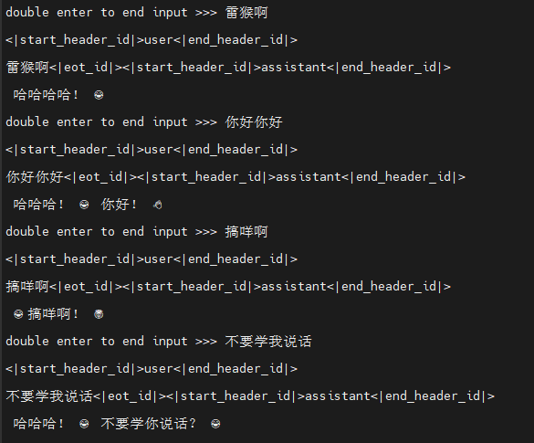
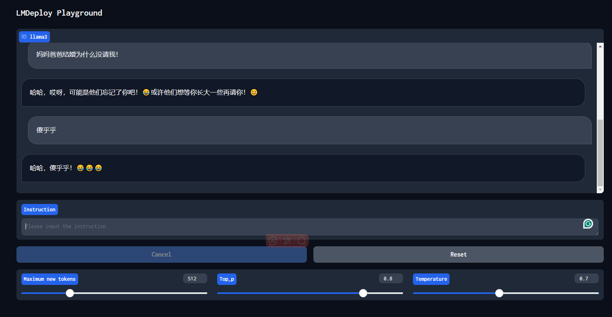

# LMDeploy 高效部署 Llama3 实践

Llama 3 近期重磅发布，发布了 8B 和 70B 参数量的模型，lmdeploy团队对 Llama 3 部署进行了光速支持！！！

书生·浦语和机智流社区同学光速投稿了 LMDeploy 高效量化部署 Llama 3，欢迎 Star。

https://github.com/internLM/LMDeploy

https://github.com/SmartFlowAI/Llama3-Tutorial/

## 本文将分为以下几个部分来介绍，如何使用LMDeploy来部署Llama3
- 环境，模型准备
- LMDeploy chat
- LMDeploy模型量化(lite) 
- LMDeploy服务(serve)

## 1. 环境，模型准备
### 1.1 环境配置

```shell
（如果使用datawahle镜像则无需配置如下内容）
# 初始化环境
conda create -n lmdeploy python=3.10
conda activate lmdeploy
conda install pytorch==2.1.2 torchvision==0.16.2 torchaudio==2.1.2 pytorch-cuda=12.1 -c pytorch -c nvidia
```

安装lmdeploy最新版。
```shell
pip install -U lmdeploy[all]
```

### 1.2 Llama3 的下载

```shell
cd ~/autodl-tmp/
# 新建一个down.py文件
# 写入

import torchfrom modelscope import snapshot_download, AutoModel, utoTokenizer import os
# 这里我用了llama3中文社区的微调的风格化表情模型，如果需要别的以相同方法到modelscope下载模型
model_dir = snapshot_download('baicai003/Llama3-Chinese-instruct-DPO-beta0.5',cache_dir='/root/autodl-tmp', revision='master')


#然后在~/autodl-tmp/ 下执行
python down.py
```

## 2. LMDeploy Chat CLI 工具

直接在终端运行
```shell
lmdeploy chat /root/autodl-tmp/baicai003/Llama3-Chinese-instruct-DPO-beta0.5
```

运行结果是：



## 3. LMDeploy模型量化(lite) 
本部分内容主要介绍如何对模型进行量化。主要包括 KV8量化和W4A16量化。

### 3.1 设置最大KV Cache缓存大小
模型在运行时，占用的显存可大致分为三部分：模型参数本身占用的显存、KV Cache占用的显存，以及中间运算结果占用的显存。LMDeploy的KV Cache管理器可以通过设置--cache-max-entry-count参数，控制KV缓存占用剩余显存的最大比例。默认的比例为0.8。

下面通过几个例子，来看一下调整`--cache-max-entry-count`参数的效果。首先保持不加该参数（默认0.8），运行 Llama3-8b 模型。

```shell
lmdeploy chat /root/autodl-tmp/baicai003/Llama3-Chinese-instruct-DPO-beta0.5
```

新建一个终端运行

```shell
# 如果你是InternStudio 就使用
# studio-smi
nvidia-smi 
```


此时模型的占用为33236M。下面，改变`--cache-max-entry-count`参数，设为0.5。

```shell
lmdeploy chat /root/autodl-tmp/baicai003/Llama3-Chinese-instruct-DPO-beta0.5 --cache-max-entry-count 0.5
```

新建一个终端运行
```shell
# 如果你是InternStudio 就使用
# studio-smi
nvidia-smi 
```


看到显存占用明显降低，变为26708M。

面来一波“极限”，把`--cache-max-entry-count`参数设置为0.01，约等于禁止KV Cache占用显存。

```shell
lmdeploy chat /root/autodl-tmp/baicai003/Llama3-Chinese-instruct-DPO-beta0.5 --cache-max-entry-count 0.01
```


然后与模型对话，可以看到，此时显存占用仅为16176M，代价是会降低模型推理速度。

### 3.2 使用W4A16量化

仅需执行一条命令，就可以完成模型量化工作。
```shell
lmdeploy lite auto_awq \
   /root/autodl-tmp/baicai003/Llama3-Chinese-instruct-DPO-beta0.5 \
  --calib-dataset 'ptb' \
  --calib-samples 128 \
  --calib-seqlen 1024 \
  --w-bits 4 \
  --w-group-size 128 \
  --work-dir /root/autodl-tmp/model/Meta-Llama-3-8B-Instruct_4bit
```
运行时间较长，请耐心等待。量化工作结束后，新的HF模型被保存到`Meta-Llama-3-8B-Instruct_4bit`目录。下面使用Chat功能运行W4A16量化后的模型。

```shell
lmdeploy chat /root/autodl-tmp/model/Meta-Llama-3-8B-Instruct_4bit --model-format awq
```

为了更加明显体会到W4A16的作用，我们将KV Cache比例再次调为0.01，查看显存占用情况。

```shell
lmdeploy chat /root/autodl-tmp/model/Meta-Llama-3-8B-Instruct_4bit --model-format awq --cache-max-entry-count 0.01
```

可以看到，显存占用变为6738MB，明显降低。


## 3.3 在线量化 KV

自 v0.4.0 起，LMDeploy KV 量化方式有原来的离线改为在线。并且，支持两种数值精度 int4、int8。量化方式为 per-head per-token 的非对称量化。它具备以下优势：
1. 量化不需要校准数据集
2. kv int8 量化精度几乎无损，kv int4 量化精度在可接受范围之内
3. 推理高效，在 llama2-7b 上加入 int8/int4 kv 量化，RPS 相较于 fp16 分别提升近 30% 和 40%
4. 支持 volta 架构（sm70）及以上的所有显卡型号：V100、20系列、T4、30系列、40系列、A10、A100 等等
通过 LMDeploy 应用 kv 量化非常简单，只需要设定 quant_policy 参数。LMDeploy 规定 qant_policy=4表示 kv int4 量化，quant_policy=8 表示 kv int8 量化。

## 4. LMDeploy服务（serve）
在前面的章节，我们都是在本地直接推理大模型，这种方式成为本地部署。在生产环境下，我们有时会将大模型封装为 API 接口服务，供客户端访问。

### 4.1 启动API服务器
通过以下命令启动API服务器，推理Meta-Llama-3-8B-Instruct模型：

```shell
lmdeploy serve api_server \
    /root/autodl-tmp/baicai003/Llama3-Chinese-instruct-DPO-beta0.5 \
    --model-format hf \
    --quant-policy 0 \
    --server-name 0.0.0.0 \
    --server-port 23333 \
    --tp 1
```

其中，model-format、quant-policy这些参数是与第三章中量化推理模型一致的；server-name和server-port表示API服务器的服务IP与服务端口；tp参数表示并行数量（GPU数量）。
通过运行以上指令，我们成功启动了API服务器。


可以配置为6006端口 然后打开浏览器，访问http://127.0.0.1:6006。但是等会记得改回来~

### 4.2 命令行客户端连接API服务器
在“4.1”中，我们在终端里新开了一个API服务器。
本节中，我们要新建一个命令行客户端去连接API服务器。首先通过VS Code新建一个终端：

运行命令行客户端：
```shell
lmdeploy serve api_client http://localhost:23333
```
运行后，可以通过命令行窗口直接与模型对话

### 4.3 网页客户端连接API服务器
关闭刚刚的VSCode终端，但服务器端的终端不要关闭。
运行之前确保自己的gradio版本低于4.0.0。
```shell
pip install gradio==3.50.2
```

使用Gradio作为前端，启动网页客户端。
```shell
lmdeploy serve gradio http://localhost:23333 \
    --server-name 0.0.0.0 \
    --server-port 6006
```
打开浏览器，访问地址http://127.0.0.1:6006
然后就可以与模型进行对话了！



# 拓展部分：

## 5. 推理速度

使用 LMDeploy 在 A100（80G）推理 Llama3，每秒请求处理数（RPS）高达 25，是 vLLM 推理效率的 1.8+ 倍。


- 克隆仓库

```shell
cd ~
git clone https://github.com/InternLM/lmdeploy.git
```

- 下载测试数据

```shell
cd /root/lmdeploy
wget https://hf-mirror.com/datasets/anon8231489123/ShareGPT_Vicuna_unfiltered/resolve/main/ShareGPT_V3_unfiltered_cleaned_split.json
```

- 执行 benchmark 命令(如果你的显存较小，可以调低`--cache-max-entry-count`)
```shell
python benchmark/profile_throughput.py \
    ShareGPT_V3_unfiltered_cleaned_split.json \
    /root/model/Meta-Llama-3-8B-Instruct \
    --cache-max-entry-count 0.8 \
    --concurrency 256 \
    --model-format hf \
    --quant-policy 0 \
    --num-prompts 10000
```
结果是：
```shell
concurrency: 256
elapsed_time: 399.739s

first token latency(s)(min, max, ave): 0.068, 4.066, 0.285
per-token latency(s) percentile(50, 75, 95, 99): [0, 0.094, 0.169, 0.227]

number of prompt tokens: 2238364
number of completion tokens: 2005448
token throughput (completion token): 5016.892 token/s
token throughput (prompt + completion token): 10616.453 token/s
RPS (request per second): 25.016 req/s
RPM (request per minute): 1500.979 req/min
```

## 6. 使用LMDeploy运行视觉多模态大模型Llava-Llama-3
### 6.1 安装依赖
```shell
pip install git+https://github.com/haotian-liu/LLaVA.git
```
### 6.2 运行模型
运行`touch /root/pipeline_llava.py` 新建一个文件夹，复制下列代码进去
```shell
from lmdeploy import pipeline, ChatTemplateConfig
from lmdeploy.vl import load_image
pipe = pipeline('xtuner/llava-llama-3-8b-v1_1-hf',
                chat_template_config=ChatTemplateConfig(model_name='llama3'))

image = load_image('https://raw.githubusercontent.com/open-mmlab/mmdeploy/main/tests/data/tiger.jpeg')
response = pipe(('describe this image', image))
print(response.text)
```
运行结果为：


你可以在 https://huggingface.co/xtuner/llava-llama-3-8b-v1_1-hf 找到更多细节

教程如有误请访问获取最新内容：
https://github.com/SmartFlowAI/Llama3-Tutorial/

LMDeploy仓库：https://github.com/InternLM/lmdeploy.git
