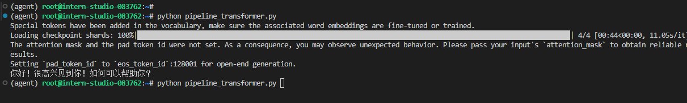
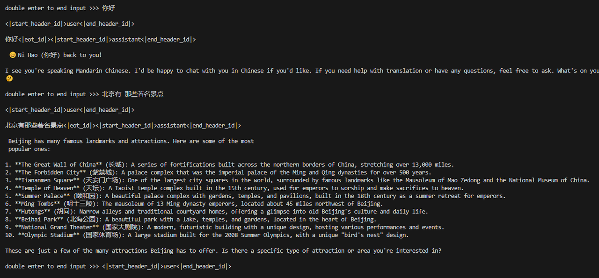
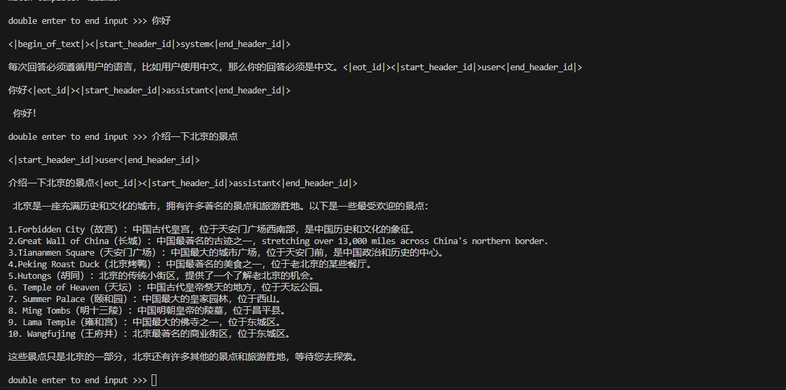
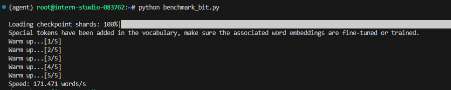
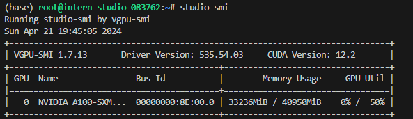
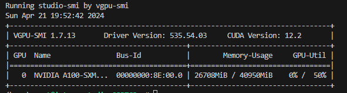
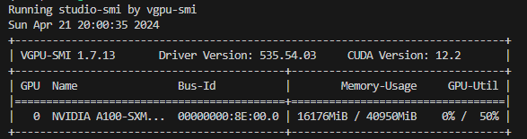
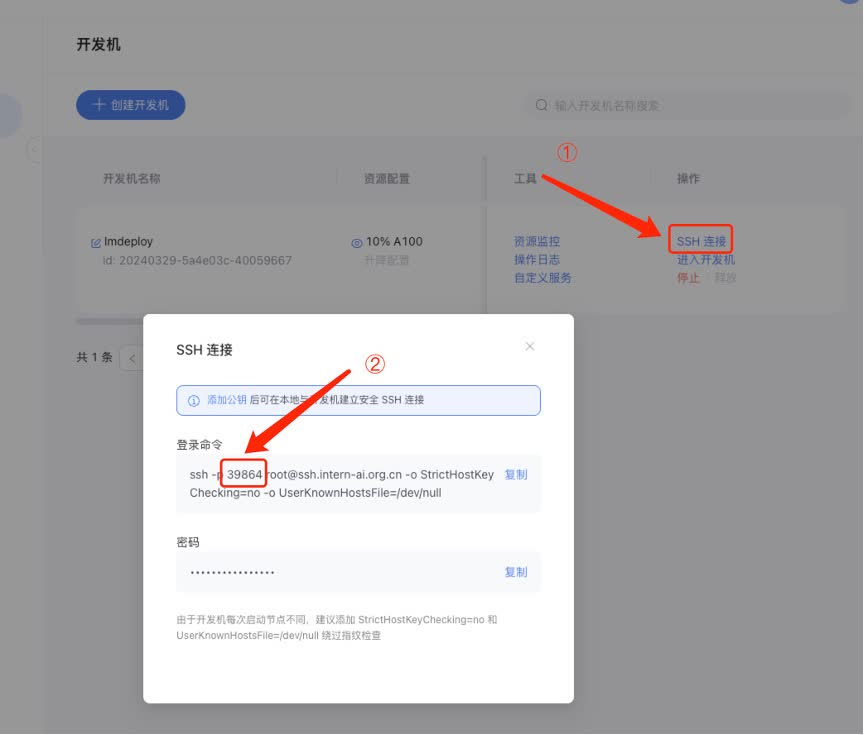
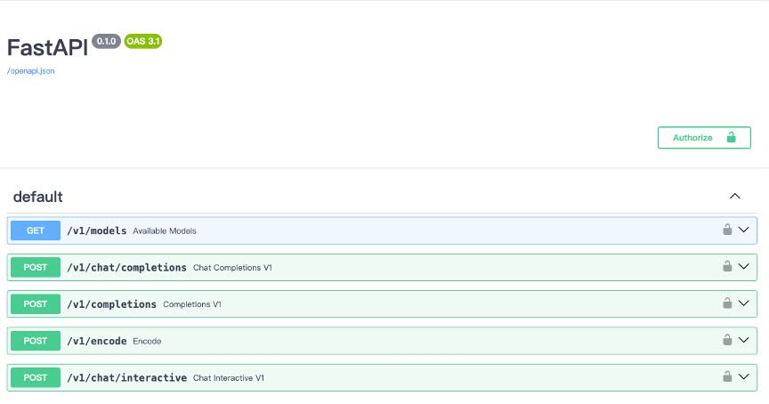

# Llama 3 高效部署实践（LMDeploy 版）

Llama 3 近期重磅发布，发布了 8B 和 70B 参数量的模型，lmdeploy团队对 Llama 3 部署进行了光速支持！！！

## 本文将分为以下几个部分来介绍，如何使用LMDeploy来部署Llama3
- 环境，模型准备
- LMDeploy chat
- Turmind和Transformer的速度对比
- LMDeploy模型量化(lite) 
- LMDeploy服务(serve)

## 1. 环境，模型准备
### 1.1 环境配置

```shell
# 如果你是InternStudio 可以直接使用
# studio-conda -t lmdeploy -o pytorch-2.1.2
# 初始化环境
conda create -n lmdeploy python=3.10
conda activate lmdeploy
conda install pytorch==2.1.2 torchvision==0.16.2 torchaudio==2.1.2 pytorch-cuda=12.1 -c pytorch -c nvidia
```

安装lmdeploy。
```shell
conda activate lmdeploy
cd ~
git clone https://github.com/InternLM/lmdeploy.git
cd lmdeploy
pip install -v -e .
pip install modelscope transformers==4.40.0 gradio==3.50.2
```
    
### 1.2 Llama3 的下载

安装 git-lfs 依赖
```shell
conda install git
git-lfs install
```
下载模型
```shell
mkdir -p ~/model
cd ~/model
git clone https://code.openxlab.org.cn/MrCat/Llama-3-8B-Instruct.git Meta-Llama-3-8B-Instruct
```

或者软链接 InternStudio 中的模型
```shell
mkdir -p ~/model
ln -s /root/share/new_models/meta-llama/Meta-Llama-3-8B-Instruct ~/model/Meta-Llama-3-8B-Instruct
```

## 2. LMDeploy chat
### 2.1 Huggingface与TurboMind

#### HuggingFace

[HuggingFace](https://huggingface.co/)是一个高速发展的社区，包括Meta、Google、Microsoft、Amazon在内的超过5000家组织机构在为HuggingFace开源社区贡献代码、数据集和模型。可以认为是一个针对深度学习模型和数据集的在线托管社区，如果你有数据集或者模型想对外分享，网盘又不太方便，就不妨托管在HuggingFace。

托管在HuggingFace社区的模型通常采用HuggingFace格式存储，简写为**HF格式**。

但是HuggingFace社区的服务器在国外，国内访问不太方便。国内可以使用阿里巴巴的[MindScope](https://www.modelscope.cn/home)社区，或者上海AI Lab搭建的[OpenXLab](https://openxlab.org.cn/home)社区，上面托管的模型也通常采用**HF格式**。

#### TurboMind 

TurboMind是LMDeploy团队开发的一款关于LLM推理的高效推理引擎，它的主要功能包括：LLaMa 结构模型的支持，continuous batch 推理模式和可扩展的 KV 缓存管理器。

TurboMind推理引擎仅支持推理TurboMind格式的模型。因此，TurboMind在推理HF格式的模型时，会首先自动将HF格式模型转换为TurboMind格式的模型。**该过程在新版本的LMDeploy中是自动进行的，无需用户操作。**

几个容易迷惑的点：
* TurboMind与LMDeploy的关系：LMDeploy是涵盖了LLM 任务全套轻量化、部署和服务解决方案的集成功能包，TurboMind是LMDeploy的一个推理引擎，是一个子模块。LMDeploy也可以使用pytorch作为推理引擎。
* TurboMind与TurboMind模型的关系：TurboMind是推理引擎的名字，TurboMind模型是一种模型存储格式，TurboMind引擎只能推理TurboMind格式的模型。

### 2.2 使用Transformer库运行模型
使用**Transformer**库之前需要确定安装的是最新版本
```shell
pip install transformers==4.40.0
```
运行`touch /root/pipeline_transformer.py` 将下面代码复制进去，然后保存。
```python
import torch
from transformers import AutoTokenizer, AutoModelForCausalLM

tokenizer = AutoTokenizer.from_pretrained("/root/model/Meta-Llama-3-8B-Instruct", trust_remote_code=True)

# Set `torch_dtype=torch.float16` to load model in float16, otherwise it will be loaded as float32 and cause OOM Error.
model = AutoModelForCausalLM.from_pretrained("/root/model/Meta-Llama-3-8B-Instruct", torch_dtype=torch.float16, trust_remote_code=True).cuda()
model = model.eval()

messages = [
    {"role": "system", "content": "你现在是一个友好的机器人，回答的时候只能使用中文"},
    {"role": "user", "content": "你好"},
]

input_ids = tokenizer.apply_chat_template(
    messages,
    add_generation_prompt=True,
    return_tensors="pt"
).to(model.device)

terminators = [
    tokenizer.eos_token_id,
    tokenizer.convert_tokens_to_ids("<|eot_id|>")
]

outputs = model.generate(
    input_ids,
    max_new_tokens=256,
    eos_token_id=terminators,
    do_sample=True,
    temperature=0.6,
    top_p=0.9,
)
response = outputs[0][input_ids.shape[-1]:]
print(tokenizer.decode(response, skip_special_tokens=True))
```
然后执行
```shell
conda activate lmdeploy
python /root/pipeline_transformer.py
```

如果模型能够正常输出结果，那就表明下载的模型没有问题。接下来，可以尝试使用lmdeploy进行对话交互。



### 2.2 使用LMDeploy与模型对话
直接在终端运行
```shell
conda activate lmdeploy
lmdeploy chat /root/model/Meta-Llama-3-8B-Instruct
```
Llama3模型在回答问题时倾向于使用英文，特别是对于稍微复杂的问题。简单的中文问题它会用中文回答，但是一旦问题变得复杂一些，就会全部使用英文。

因此需要修改prompt，打开`/root/lmdeploy/lmdeploy/model.py`找到527行，
修改变量：`meta_instruction`。这个变量就代表了引导词。

```python
meta_instruction='每次回答必须遵循用户的语言，比如用户使用中文，那么你的回答必须是中文。'
```

当然你也可以试试别的引导词。
接下来终端运行

```shell
conda activate lmdeploy
lmdeploy chat /root/model/Meta-Llama-3-8B-Instruct
```


可以看到这次的回答基本全是中文，但仍然夹带了一些英文。

## 3. Turmind和Transformer的速度对比
在终端输入`touch /root/pipeline_transformer.py` 然后将下面代码复制进去然后保存。

```python
import torch
import datetime
from transformers import AutoTokenizer, AutoModelForCausalLM

tokenizer = AutoTokenizer.from_pretrained("/root/model/Meta-Llama-3-8B-Instruct", trust_remote_code=True)

# Set `torch_dtype=torch.float16` to load model in float16, otherwise it will be loaded as float32 and cause OOM Error.
model = AutoModelForCausalLM.from_pretrained("/root/model/Meta-Llama-3-8B-Instruct", torch_dtype=torch.float16, trust_remote_code=True).cuda()
model = model.eval()

def chat(model, tokenizer, word, history=[]):
    messages = [
        {"role": "system", "content": "你现在是一个友好的机器人，回答的时候只能使用中文"},
        {"role": "user", "content": "你好"},
    ]

    input_ids = tokenizer.apply_chat_template(
        messages,
        add_generation_prompt=True,
        return_tensors="pt"
    ).to(model.device)

    terminators = [
        tokenizer.eos_token_id,
        tokenizer.convert_tokens_to_ids("<|eot_id|>")
    ]

    outputs = model.generate(
        input_ids,
        max_new_tokens=256,
        eos_token_id=terminators,
        do_sample=True,
        temperature=0.6,
        top_p=0.9,
        pad_token_id=tokenizer.eos_token_id
    )
    response = outputs[0][input_ids.shape[-1]:]
    # print(tokenizer.decode(response, skip_special_tokens=True))
    return tokenizer.decode(response, skip_special_tokens=True), history

# warmup
inp = "hello"
for i in range(5):
    print("Warm up...[{}/5]".format(i+1))
    response, history = chat(model, tokenizer, inp, history=[])

# test speed
inp = "请介绍一下你自己。"
times = 10
total_words = 0
start_time = datetime.datetime.now()
for i in range(times):
    response, history = chat(model, tokenizer, inp, history=[])
    total_words += len(response)
end_time = datetime.datetime.now()

delta_time = end_time - start_time
delta_time = delta_time.seconds + delta_time.microseconds / 1000000.0
speed = total_words / delta_time
print("Speed: {:.3f} words/s".format(speed))
```

然后在终端输入

```shell
conda activate lmdeploy
python /root/benchmark_transformer.py
```

运行结果

运行`touch /root/benchmark_lmdeploy.py` 将下面代码复制进去然后保存。

```python
import datetime
from lmdeploy import pipeline

pipe = pipeline('/root/model/Meta-Llama-3-8B-Instruct')

# warmup
inp = "hello"
for i in range(5):
    print("Warm up...[{}/5]".format(i+1))
    response = pipe([inp])

# test speed
inp = "请介绍一下你自己。"
times = 10
total_words = 0
start_time = datetime.datetime.now()
for i in range(times):
    response = pipe([inp])
    total_words += len(response[0].text)
end_time = datetime.datetime.now()

delta_time = end_time - start_time
delta_time = delta_time.seconds + delta_time.microseconds / 1000000.0
speed = total_words / delta_time
print("Speed: {:.3f} words/s".format(speed))
```
然后在终端输入
```shell
conda activate lmdeploy
python /root/benchmark_lmdeploy.py
```
运行结果




可以看到，LMDeploy的推理速度约为171.471 words/s，是Transformer库的 5.3 倍。

## 4. LMDeploy模型量化(lite) 
本部分内容主要介绍如何对模型进行量化。主要包括 KV8量化和W4A16量化。

### 4.1 设置最大KV Cache缓存大小
模型在运行时，占用的显存可大致分为三部分：模型参数本身占用的显存、KV Cache占用的显存，以及中间运算结果占用的显存。LMDeploy的KV Cache管理器可以通过设置--cache-max-entry-count参数，控制KV缓存占用剩余显存的最大比例。默认的比例为0.8。

下面通过几个例子，来看一下调整`--cache-max-entry-count`参数的效果。首先保持不加该参数（默认0.8），运行 Llama3-8b 模型。
```shell
lmdeploy chat /root/model/Meta-Llama-3-8B-Instruct/
```
新建一个终端运行
```shell
# 如果你是InternStudio 就使用
# studio-smi
nvidia-smi 
```



此时模型的占用为33236M。下面，改变`--cache-max-entry-count`参数，设为0.5。
```shell
lmdeploy chat /root/model/Meta-Llama-3-8B-Instruct/ --cache-max-entry-count 0.5
```
新建一个终端运行
```shell
# 如果你是InternStudio 就使用
# studio-smi
nvidia-smi 
```



看到显存占用明显降低，变为26708M。

面来一波“极限”，把`--cache-max-entry-count`参数设置为0.01，约等于禁止KV Cache占用显存。

```shell
lmdeploy chat /root/model/Meta-Llama-3-8B-Instruct/ --cache-max-entry-count 0.01
```


然后与模型对话，可以看到，此时显存占用仅为16176M，代价是会降低模型推理速度。

### 4.2 使用W4A16量化
运行前，首先安装一个依赖库。
```shell
conda activate lmdeploy
pip install einops==0.7.0
```
仅需执行一条命令，就可以完成模型量化工作。
```shell
lmdeploy lite auto_awq \
   /root/model/Meta-Llama-3-8B-Instruct \
  --calib-dataset 'ptb' \
  --calib-samples 128 \
  --calib-seqlen 1024 \
  --w-bits 4 \
  --w-group-size 128 \
  --work-dir /root/model/Meta-Llama-3-8B-Instruct_4bit
```
运行时间较长，请耐心等待。量化工作结束后，新的HF模型被保存到`Meta-Llama-3-8B-Instruct_4bit`目录。下面使用Chat功能运行W4A16量化后的模型。
```shell
lmdeploy chat /root/model/Meta-Llama-3-8B-Instruct_4bit --model-format awq
```
为了更加明显体会到W4A16的作用，我们将KV Cache比例再次调为0.01，查看显存占用情况。
```shell
lmdeploy chat /root/model/Meta-Llama-3-8B-Instruct_4bit --model-format awq --cache-max-entry-count 0.01
```
可以看到，显存占用变为16176MB，明显降低。


## 5. LMDeploy服务(serve)
在前面的章节，我们都是在本地直接推理大模型，这种方式成为本地部署。在生产环境下，我们有时会将大模型封装为API接口服务，供客户端访问。

### 5.1 启动API服务器
通过以下命令启动API服务器，推理Meta-Llama-3-8B-Instruct模型：

```shell
lmdeploy serve api_server \
    /root/model/Meta-Llama-3-8B-Instruct \
    --model-format hf \
    --quant-policy 0 \
    --server-name 0.0.0.0 \
    --server-port 23333 \
    --tp 1
```

其中，model-format、quant-policy这些参数是与第三章中量化推理模型一致的；server-name和server-port表示API服务器的服务IP与服务端口；tp参数表示并行数量（GPU数量）。
通过运行以上指令，我们成功启动了API服务器，请勿关闭该窗口，后面我们要新建客户端连接该服务。
你也可以直接打开http://{host}:23333查看接口的具体使用说明，如下图所示。



注意，这一步由于Server在远程服务器上，所以本地需要做一下ssh转发才能直接访问。在你本地打开一个cmd窗口，输入命令如下：

```shell
ssh -CNg -L 23333:127.0.0.1:23333 root@ssh.intern-ai.org.cn -p 你的ssh端口号
```

ssh 端口号就是下面图片里的 39864，请替换为你自己的。



然后打开浏览器，访问http://127.0.0.1:23333。

### 5.2 命令行客户端连接API服务器
在“5.1”中，我们在终端里新开了一个API服务器。
本节中，我们要新建一个命令行客户端去连接API服务器。首先通过VS Code新建一个终端：
激活conda环境
```shell
conda activate lmdeploy
```
运行命令行客户端：
```shell
lmdeploy serve api_client http://localhost:23333
```
运行后，可以通过命令行窗口直接与模型对话

### 5.3 网页客户端连接API服务器
关闭刚刚的VSCode终端，但服务器端的终端不要关闭。
运行之前确保自己的gradio版本低于4.0.0。
```shell
pip install gradio==3.50.2
```
新建一个VSCode终端，激活conda环境。
```shell
conda activate lmdeploy
使用Gradio作为前端，启动网页客户端。
lmdeploy serve gradio http://localhost:23333 \
    --server-name 0.0.0.0 \
    --server-port 6006
```
打开浏览器，访问地址http://127.0.0.1:6006
然后就可以与模型进行对话了！
